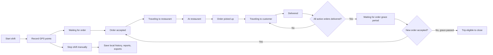

# Delivery Route Tracker

Android-first Flutter app for tracking food delivery shifts, routes, stops, wait time, earnings, and daily route history.

This project was built with help from an AI coding agent in Codex. The app idea, workflow decisions, and feature requirements came from the delivery use case; Codex helped debug, test, document, and package the Flutter Android app.

## APK

Latest local APK:

[Download latest APK](releases/delivery-route-tracker-latest.apk)

This APK was refreshed after the v0.11 stop-shift reliability and Reports tab update.

Build output APK:

`build/app/outputs/flutter-apk/app-release.apk`

Install on Android:

1. Copy the APK to the phone or install with ADB.
2. Enable installation from unknown sources if Android asks.
3. Open **Delivery Tracker**.
4. Grant location and notification permissions.
5. On some phones, disable battery optimization for the app so background tracking can continue reliably.

ADB install:

```powershell
C:\Android\Sdk\platform-tools\adb.exe install -r releases\delivery-route-tracker-latest.apk
```

## Screenshots

Tracker home and delivery lifecycle controls:


Live map preview:


## What The App Does

Delivery Route Tracker is designed for part-time or full-time food delivery work. It records a delivery shift, saves GPS points locally, automatically detects trips and stops, and gives daily summaries for route review and earnings analysis.

Core tracking model:



## Final Requirements Update

The latest update is focused on real-world delivery operations. Existing features should remain unchanged unless they are directly related to shift continuity, lifecycle tracking, multi-order delivery handling, journey segmentation, route visualization, or historical data preservation.

### Shift Continuity

The app should not treat application state as delivery state. A shift or trip should not be ended just because:

- The app was closed.
- The app crashed.
- The app was sent to the background.
- GPS was temporarily unavailable.
- Internet connectivity was lost.
- The device restarted.

Only intentional user actions should end a shift. The Stop button is the intentional end-shift action.

Implemented in the current codebase:

- Active shift ID is stored locally.
- Active shifts are autosaved while tracking.
- The app attempts to recover an active shift when reopened.
- Recovery uses a configurable grace period.
- Android back/close navigation shows a warning while a shift is active.
- End Shift uses a guarded save flow so repeated taps cannot start multiple finalization attempts.
- Successful End Shift clears the active recovery copy so a saved shift is not accidentally restored as still active.

### Recovery Grace Period

The recovery grace period controls how long an accidentally closed active shift remains recoverable.

Available settings:

- 30 minutes
- 1 hour
- 2 hours
- 4 hours

If the app is reopened inside the grace period, the previous active shift can resume from saved local state. This protects against accidental closure and temporary interruption.

### Expanded Delivery Lifecycle

The delivery lifecycle card now represents a fuller delivery workflow.

Shift-level states:

- Shift started
- Shift paused
- Shift ended

Order and journey states:

- Waiting for order
- Order accepted
- Traveling to restaurant
- At restaurant
- Order picked up
- Traveling to customer
- Delivered

Exception and optional states:

- Multiple orders active
- Delayed at restaurant
- Customer unavailable
- Order cancelled

The lifecycle card displays:

- Current status
- Active order count
- Current trip ID
- Trip start time
- Active duration
- Distance travelled
- Recent status history

### Standard Delivery Workflow

A normal single-order delivery should follow:

1. Shift started
2. Waiting for order
3. Order accepted
4. Traveling to restaurant
5. At restaurant
6. Order picked up
7. Traveling to customer
8. Delivered
9. Waiting for order

The cycle repeats when a new order arrives.

### Trip And Order Model

The updated model separates a shift, a trip, and an order.

| Concept | Meaning |
| --- | --- |
| Shift | The full working session from Start Shift to Stop Shift. |
| Trip | A delivery work cycle that begins when the first order is accepted and continues until all related orders are delivered and the waiting grace period passes. |
| Order | One individual delivery inside a trip. A trip can contain one or many orders. |

New data is stored alongside the older route/segment model. This keeps existing saved history compatible while allowing new trips to use the richer order model.

### Multiple Order Support

The app supports stacked delivery scenarios where another order arrives before the current delivery is complete.

Example:

1. Order A accepted.
2. Driver travels to Restaurant A.
3. Order A picked up.
4. Order B accepted before Order A is delivered.
5. Driver travels to Restaurant B.
6. Order B picked up.
7. Order A delivered.
8. Order B delivered.
9. Driver returns to Waiting for order.

All of this remains inside the same active trip. A new trip is not created just because another order is accepted during an active route.

### Trip Completion Rule

A trip is not complete until every active order in that trip is delivered or cancelled.

Business rule:

```text
Active Orders = Picked Up Orders - Delivered Orders
```

If active orders are greater than zero:

- The trip remains active.

If active orders are zero:

- The trip becomes eligible for closure only after the driver returns to Waiting for order and the trip closure grace period passes.

This prevents a trip from ending too early when a driver is still carrying food or still returning to a waiting area.

### Waiting Period And Grace Zone

After a delivery is completed, the driver may travel to a hotspot, city center, restaurant area, or preferred waiting location. That movement is still useful delivery-work movement.

Current behavior goal:

1. User marks an order as Delivered.
2. User selects Waiting for order.
3. User moves toward a waiting location.
4. The route is still tracked as part of the current trip during the grace period.
5. If a new order is accepted during that waiting period, the same trip continues.
6. If no order arrives and the grace period passes, the trip becomes eligible for closure.

### Route And Stop Detection

The app still keeps the earlier GPS segmentation behavior:

- Stop/wait zone radius: 300 meters.
- Stop detection delay: 60 seconds.
- GPS points are filtered for weak accuracy, speed spikes, and obvious jumps.
- Stops can be classified as restaurant, customer, break, waiting for order, or other.

### Map Visualization Requirements

The latest requirements call for easier route inspection and clearer map visuals.

Implemented:

- More visible trip start and current/end markers.
- Stop marker colors/icons by stop type.
- Active map controls for zoom in, zoom out, recenter, and fullscreen route inspection.
- Existing pan, drag, pinch zoom, and double-tap zoom support.
- Timeline playback with point details.

Planned:

- Status-based route coloring, such as gray for waiting, blue for traveling to restaurant, orange for traveling to customer, and green for active delivery.
- Full route summary overlay on the map.
- Fit entire trip to screen control.
- More advanced route smoothing.

### Backward Compatibility

Historical data preservation is a requirement.

Current strategy:

- Existing shifts, routes, stops, and earnings remain in the legacy structure.
- New fields are optional when reading JSON.
- Missing fields receive safe defaults.
- No automatic conversion of old history is performed in this release.

Future migration may convert older route segments into the new trip/order model, but that should be a separate migration task so old records are not corrupted.

## Current Features

- Android foreground tracking so movement can continue while the app is backgrounded or the screen is locked.
- Active shift autosave every 30 seconds to reduce data loss if Android kills the app.
- Active shift recovery with configurable grace period after accidental closure.
- GPS route recording with point-by-point route history.
- Route quality cleanup for weak GPS accuracy, impossible jumps, and unrealistic speed spikes.
- Automatic trip and stop detection.
- Stop/wait zone radius: **300 meters**.
- Stop detection delay: **60 seconds**.
- Battery-safe mode that lowers GPS frequency while stopped and uses higher accuracy while moving.
- Expanded delivery lifecycle: **Shift started**, **Waiting for order**, **Order accepted**, **Traveling to restaurant**, **At restaurant**, **Order picked up**, **Traveling to customer**, **Delivered**, plus optional exception states.
- Lifecycle controls in app and notification actions.
- Order/trip data model for stacked and multi-order deliveries.
- Auto stop classification: **Restaurant**, **Customer**, **Break**, **Waiting for order**, **Other**.
- Stop classification in app and notification actions.
- Editable restaurant/pickup name for each trip.
- Platform selection: **Wolt** or **Uber Eats**.
- Manual trip earnings entry after a shift.
- Uber Eats net earnings calculation with 25.5% deduction.
- Calendar/day view for selected dates.
- Reports tab for performance analytics, route playback, verification, timeline review, and exports.
- Google Maps Timeline-style day route view.
- Timeline playback with slider and tappable point details.
- Route verification: confirm detected trips and stops after review.
- Daily, weekly, and monthly performance analytics.
- Idle-vs-active delivery analysis, including active delivery time, no-order waiting time, waiting percentage, waiting distance, and active delivery distance.
- Local diagnostics panel for GPS errors, permissions, notification status, and tracking service state.
- Map controls for zoom, recenter, and fullscreen active route inspection.
- Local-only storage with CSV, JSON, GPX, and KML export options.
- Dark mode for battery-friendly delivery sessions.

## Version History / Milestones

These are feature milestones for this prototype. The package version in `pubspec.yaml` is currently `0.1.0+1`; future releases should bump that version when APKs are published.

| Milestone | Focus | What Was Added |
| --- | --- | --- |
| v0.1 | Basic tracker | Flutter Android app, start/stop shift, GPS point capture, local shift save. |
| v0.2 | Route logic | Automatic trip segmentation, 300 m stop zone, 60 second stop detection, route preview map. |
| v0.3 | Permissions and background | Android foreground location tracking, notification permission handling, settings diagnostics for required permissions. |
| v0.4 | Daily history | Calendar tab, selected day route view, saved shift list, stop editing, CSV export. |
| v0.5 | Earnings | Trip restaurant field, Wolt/Uber Eats platform selection, manual trip earnings, daily earnings tab, Uber Eats 25.5% deduction. |
| v0.6 | Timeline | Full-day GPS point storage, map timeline view, route path display, stop markers. |
| v0.7 | Delivery workflow | Lifecycle buttons, notification actions, stop classification prompts, JSON backup/restore. |
| v0.8 | Production hardening | GPS quality filtering, active shift autosave, route verification, timeline playback, performance analytics, diagnostics, GPX/KML exports. |
| v0.9 | Shift continuity and multi-order model | Accidental-close recovery, configurable recovery grace period, expanded lifecycle statuses, order/trip data model, stacked delivery support, active order count, trip closure rules, improved map markers and controls. |
| v0.10 | Idle and active performance analytics | Calendar Performance period switch for day/week/month, active-order time calculation, no-order waiting time, waiting-vs-active ratio, waiting distance, and active delivery distance. |
| v0.11 | Stop shift reliability and UI organization | Guarded End Shift finalization, active recovery cleanup after save, shorter Calendar tab, and separate Reports tab for analytics, verification, playback, and exports. |

## Working Process

1. Start a shift before beginning delivery work.
2. Keep the app running or send it to the background.
3. Android shows an ongoing tracking notification.
4. The app records GPS points and builds a route path.
5. When movement stays inside the 300 m wait zone for more than 60 seconds, the app creates a stop.
6. Classify the stop as restaurant, customer, break, waiting for order, or other.
7. Use lifecycle buttons during delivery:
   - Waiting for order
   - Order accepted
   - Traveling to restaurant
   - At restaurant
   - Order picked up
   - Traveling to customer
   - Delivered
8. Add extra accepted orders during an active trip for stacked deliveries.
9. A trip is eligible to close only after all active orders are delivered and the driver returns to waiting mode for the configured grace period.
10. Stop the shift only when finished.
11. Review detected trips and stops in Calendar.
12. Add restaurant names, platform, and earnings.
13. Check daily earnings and day/week/month performance analytics.
14. Export data as CSV, JSON, GPX, or KML.

## Analytics

The app calculates:

- Total working hours
- Moving time
- Waiting time
- Active delivery time
- Waiting time with no active order
- Waiting time vs active delivery time ratio
- Distance traveled
- Distance traveled while waiting for orders
- Distance traveled during active deliveries
- Total gross earnings
- Total net earnings
- Earnings per hour
- Earnings per kilometer
- Wolt totals
- Uber Eats gross and net totals

Performance can be reviewed for:

- Selected day
- Selected week
- Selected month

Active delivery time is calculated from structured order data when available, using each order's accepted-to-delivered or accepted-to-cancelled interval. Older records without structured order data fall back to lifecycle events such as Order accepted, Picked up, Delivered, Cancelled, and Waiting for order.

Uber Eats formula:

```text
net = gross * (1 - 0.255)
```

Example:

```text
2.30 + 4.70 = 7.00 gross
7.00 * 0.745 = 5.215 net
```

## Export Options

| Format | Purpose |
| --- | --- |
| CSV | Spreadsheet analysis, reporting, filtering trips/stops/earnings. |
| JSON | Full backup and restore of app data. |
| GPX | Route viewing in GPS and mapping tools. |
| KML | Google Earth and GIS-compatible route viewing. |

Exports are saved to the app documents folder on the Android device.

## Tech Stack

| Layer | Technology | Use In This App |
| --- | --- | --- |
| App framework | Flutter | Android mobile UI, Material widgets, dark mode, tab navigation, forms, timeline screens, and route review screens. |
| Language | Dart | App state, route segmentation, stop detection, earnings logic, analytics, import/export generation, and local data models. |
| Target platform | Android | Primary supported platform for foreground/background delivery tracking. |
| GPS/location | `geolocator` | Location permissions, current position, movement stream, speed/accuracy readings, and route point capture. |
| Maps | `flutter_map`, `latlong2`, OpenStreetMap tiles | Live route preview, day map, playback map, route polylines, start/end markers, stop markers, and map interaction. |
| Notifications | `flutter_local_notifications` | Ongoing tracking notification, trip status actions, stop classification actions, and Android notification setup. |
| Permissions | `permission_handler` plus Android manifest permissions | Location, background location, notifications, overlay diagnostics, foreground service, wake lock, internet, and legacy external storage declarations. |
| Local files | `path_provider`, `dart:io` | App documents folder storage for saved shift history, active shift recovery, CSV, JSON, GPX, and KML files. |
| Local preferences | `shared_preferences` | Battery-safe mode, active shift marker, recovery grace setting, and compatibility fallback for older saved history. |
| Date/time formatting | `intl` | Calendar labels, timeline timestamps, export filenames, and report periods. |
| Analytics engine | In-app Dart models | Moving/waiting time, active delivery time, no-order waiting time, waiting-vs-active ratio, distance split, earnings/hour, earnings/km, and Wolt/Uber Eats totals. |
| Export formats | CSV, JSON, GPX, KML | Spreadsheet analysis, backup/restore, and route viewing in mapping/GIS tools. |
| Android build | Gradle wrapper, Android Gradle Plugin, Kotlin/Java toolchain | APK build, manifest merging, debug/release packaging, and Android app signing. |
| QA tooling | `flutter_lints`, `flutter_test`, `dart analyze` | Static analysis, linting, and test scaffold for future route/tracking test coverage. |

Android manifest permissions currently include:

- `ACCESS_FINE_LOCATION`
- `ACCESS_COARSE_LOCATION`
- `ACCESS_BACKGROUND_LOCATION`
- `FOREGROUND_SERVICE`
- `FOREGROUND_SERVICE_LOCATION`
- `POST_NOTIFICATIONS`
- `WAKE_LOCK`
- `INTERNET`
- `SYSTEM_ALERT_WINDOW`
- Legacy `READ_EXTERNAL_STORAGE` and `WRITE_EXTERNAL_STORAGE` with Android version limits

## Android Permissions

The app uses Android permissions for:

- Fine/coarse location
- Background/foreground location tracking
- Foreground service
- Notifications
- Wake lock
- Internet for map tiles
- Optional overlay permission diagnostics

For best results:

- Allow location access.
- Allow notifications.
- Allow background location where Android asks.
- Disable battery optimization for this app on strict Android vendors.

## Privacy

Location history is sensitive. This app currently stores data locally on the device and does not send route history to a cloud backend.

Recommended future privacy improvements:

- Fingerprint or device biometric lock before opening the app.
- PIN fallback.
- Encrypted local storage for route history.
- Auto-delete old route data after a selected number of days.
- Export password protection.

## Pros

- Built specifically for food delivery route tracking.
- Works without a cloud account.
- Tracks trips, stops, wait time, and delivery lifecycle.
- Useful for personal reporting and earnings analysis.
- Supports Wolt and Uber Eats earnings rules.
- Exports data in analysis and mapping formats.
- Dark mode and battery-safe tracking are included.
- Diagnostics help identify permission or GPS problems.

## Cons / Limitations

- Android background tracking reliability can still depend on phone vendor battery rules.
- The app is currently Android-focused; iOS is not implemented.
- Restaurant/place names are manually entered or confirmed; automatic place suggestions are not implemented yet.
- JSON restore currently uses clipboard-based import, not a full file picker.
- OpenStreetMap tiles require internet access.
- Data is local but not encrypted yet.
- Notification action handling is implemented through Flutter notification callbacks; deeper native service action handling would be stronger for killed-app scenarios.
- Historical legacy shifts are preserved as recorded; they are not automatically migrated into the new order/trip model.

## Roadmap

High-priority improvements:

- Fingerprint/biometric lock for sensitive location data.
- Encrypted local storage.
- Native Android foreground service action handling for stronger killed-app behavior.
- File picker for JSON import/export.
- Automatic restaurant/place suggestions near detected stops.
- Dedicated migration tool for converting legacy routes into the newer trip/order model.
- Battery optimization guide screen per Android vendor.
- Offline map cache.
- More robust route smoothing and GPS confidence scoring.
- Unit tests for route segmentation and GPS filtering.
- Better screenshot gallery and release notes per APK.

## Development

Install Flutter, then run:

```powershell
flutter pub get
flutter run
```

Analyze:

```powershell
flutter analyze
```

Test:

```powershell
flutter test
```

Build release APK:

```powershell
flutter build apk --release
```

Use a real Android phone for GPS/background testing. Emulator GPS and background-service behavior can differ from real delivery conditions.

## Project Status

Prototype is functional and installed successfully on a real Android device during development. It is not yet a Play Store-ready release because privacy hardening, native service resilience, app signing/release management, and route logic test coverage should be improved before public distribution.
