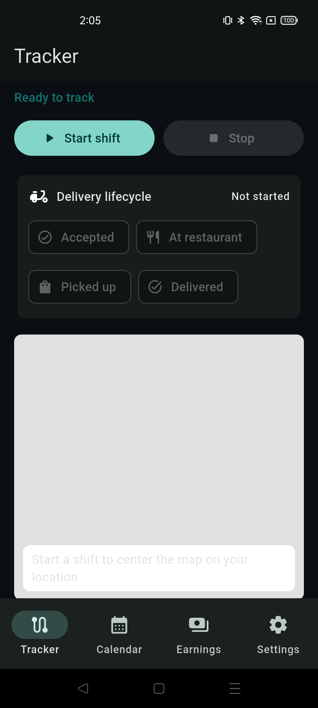
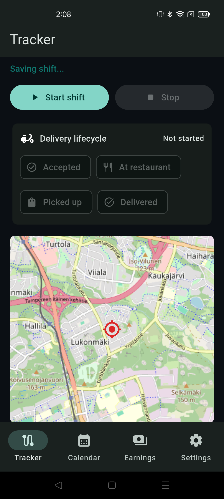
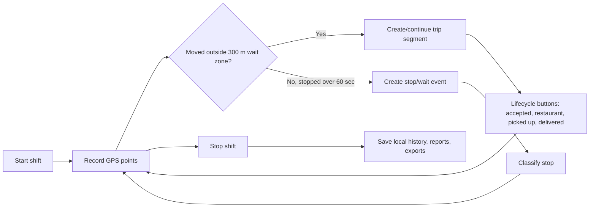

# Delivery Route Tracker

Android-first Flutter app for tracking food delivery shifts, routes, stops, wait time, earnings, and daily route history.

This project was built with help from an AI coding agent in Codex. The app idea, workflow decisions, and feature requirements came from the delivery use case; Codex helped implement, debug, test, document, and package the Flutter Android app.

## APK

Latest local APK:

[Download latest APK](releases/delivery-route-tracker-latest.apk)

Build output APK:

`build/app/outputs/flutter-apk/app-release.apk`

Install on Android:

1. Copy the APK to the phone or install with ADB.
2. Enable installation from unknown sources if Android asks.
3. Open **Delivery Tracker**.
4. Grant location and notification permissions.
5. On some phones, disable battery optimization for the app so background tracking can continue reliably.

ADB install:

```powershell
C:\Android\Sdk\platform-tools\adb.exe install -r releases\delivery-route-tracker-latest.apk
```

## Screenshots

Tracker home and delivery lifecycle controls:



Live map preview:



## What The App Does

Delivery Route Tracker is designed for part-time or full-time food delivery work. It records a delivery shift, saves GPS points locally, automatically detects trips and stops, and gives daily summaries for route review and earnings analysis.

Core tracking model:



## Current Features

- Android foreground tracking so movement can continue while the app is backgrounded or the screen is locked.
- Active shift autosave every 30 seconds to reduce data loss if Android kills the app.
- GPS route recording with point-by-point route history.
- Route quality cleanup for weak GPS accuracy, impossible jumps, and unrealistic speed spikes.
- Automatic trip and stop detection.
- Stop/wait zone radius: **300 meters**.
- Stop detection delay: **60 seconds**.
- Battery-safe mode that lowers GPS frequency while stopped and uses higher accuracy while moving.
- Delivery lifecycle buttons: **Accepted**, **At restaurant**, **Picked up**, **Delivered**.
- Lifecycle controls in app and notification actions.
- Auto stop classification: **Restaurant**, **Customer**, **Break**, **Waiting for order**, **Other**.
- Stop classification in app and notification actions.
- Editable restaurant/pickup name for each trip.
- Platform selection: **Wolt** or **Uber Eats**.
- Manual trip earnings entry after a shift.
- Uber Eats net earnings calculation with 25.5% deduction.
- Calendar/day view for selected dates.
- Google Maps Timeline-style day route view.
- Timeline playback with slider and tappable point details.
- Route verification: confirm detected trips and stops after review.
- Daily performance analytics.
- Local diagnostics panel for GPS errors, permissions, notification status, and tracking service state.
- Local-only storage with CSV, JSON, GPX, and KML export options.
- Dark mode for battery-friendly delivery sessions.

## Version History / Milestones

These are feature milestones for this prototype. The package version in `pubspec.yaml` is currently `0.1.0+1`; future releases should bump that version when APKs are published.

| Milestone | Focus | What Was Added |
| --- | --- | --- |
| v0.1 | Basic tracker | Flutter Android app, start/stop shift, GPS point capture, local shift save. |
| v0.2 | Route logic | Automatic trip segmentation, 300 m stop zone, 60 second stop detection, route preview map. |
| v0.3 | Permissions and background | Android foreground location tracking, notification permission handling, settings diagnostics for required permissions. |
| v0.4 | Daily history | Calendar tab, selected day route view, saved shift list, stop editing, CSV export. |
| v0.5 | Earnings | Trip restaurant field, Wolt/Uber Eats platform selection, manual trip earnings, daily earnings tab, Uber Eats 25.5% deduction. |
| v0.6 | Timeline | Full-day GPS point storage, map timeline view, route path display, stop markers. |
| v0.7 | Delivery workflow | Lifecycle buttons, notification actions, stop classification prompts, JSON backup/restore. |
| v0.8 | Production hardening | GPS quality filtering, active shift autosave, route verification, timeline playback, performance analytics, diagnostics, GPX/KML exports. |

## Working Process

1. Start a shift before beginning delivery work.
2. Keep the app running or send it to the background.
3. Android shows an ongoing tracking notification.
4. The app records GPS points and builds a route path.
5. When movement stays inside the 300 m wait zone for more than 60 seconds, the app creates a stop.
6. Classify the stop as restaurant, customer, break, waiting for order, or other.
7. Use lifecycle buttons during delivery:
   - Accepted
   - At restaurant
   - Picked up
   - Delivered
8. Stop the shift when finished.
9. Review detected trips and stops in Calendar.
10. Add restaurant names, platform, and earnings.
11. Check daily earnings and performance analytics.
12. Export data as CSV, JSON, GPX, or KML.

## Analytics

The app calculates:

- Total working hours
- Moving time
- Waiting time
- Distance traveled
- Total gross earnings
- Total net earnings
- Earnings per hour
- Earnings per kilometer
- Wolt totals
- Uber Eats gross and net totals

Uber Eats formula:

```text
net = gross * (1 - 0.255)
```

Example:

```text
2.30 + 4.70 = 7.00 gross
7.00 * 0.745 = 5.215 net
```

## Export Options

| Format | Purpose |
| --- | --- |
| CSV | Spreadsheet analysis, reporting, filtering trips/stops/earnings. |
| JSON | Full backup and restore of app data. |
| GPX | Route viewing in GPS and mapping tools. |
| KML | Google Earth and GIS-compatible route viewing. |

Exports are saved to the app documents folder on the Android device.

## Tech Stack

- Flutter
- Dart
- Android
- `geolocator` for GPS and foreground tracking
- `flutter_map` for OpenStreetMap-based maps
- `flutter_local_notifications` for tracking and action notifications
- `permission_handler` for Android permission flows
- `path_provider` for local export paths
- `shared_preferences` for local persisted shift data and settings
- OpenStreetMap tiles for map rendering

## Android Permissions

The app uses Android permissions for:

- Fine/coarse location
- Background/foreground location tracking
- Foreground service
- Notifications
- Wake lock
- Internet for map tiles
- Optional overlay permission diagnostics

For best results:

- Allow location access.
- Allow notifications.
- Allow background location where Android asks.
- Disable battery optimization for this app on strict Android vendors.

## Privacy

Location history is sensitive. This app currently stores data locally on the device and does not send route history to a cloud backend.

Recommended future privacy improvements:

- Fingerprint or device biometric lock before opening the app.
- PIN fallback.
- Encrypted local storage for route history.
- Auto-delete old route data after a selected number of days.
- Export password protection.

## Pros

- Built specifically for food delivery route tracking.
- Works without a cloud account.
- Tracks trips, stops, wait time, and delivery lifecycle.
- Useful for personal reporting and earnings analysis.
- Supports Wolt and Uber Eats earnings rules.
- Exports data in analysis and mapping formats.
- Dark mode and battery-safe tracking are included.
- Diagnostics help identify permission or GPS problems.

## Cons / Limitations

- Android background tracking reliability can still depend on phone vendor battery rules.
- The app is currently Android-focused; iOS is not implemented.
- Restaurant/place names are manually entered or confirmed; automatic place suggestions are not implemented yet.
- JSON restore currently uses clipboard-based import, not a full file picker.
- OpenStreetMap tiles require internet access.
- Data is local but not encrypted yet.
- Notification action handling is implemented through Flutter notification callbacks; deeper native service action handling would be stronger for killed-app scenarios.

## Roadmap

High-priority improvements:

- Fingerprint/biometric lock for sensitive location data.
- Encrypted local storage.
- Native Android foreground service action handling for stronger killed-app behavior.
- File picker for JSON import/export.
- Automatic restaurant/place suggestions near detected stops.
- Battery optimization guide screen per Android vendor.
- Offline map cache.
- More robust route smoothing and GPS confidence scoring.
- Unit tests for route segmentation and GPS filtering.
- Better screenshot gallery and release notes per APK.

## Development

Install Flutter, then run:

```powershell
flutter pub get
flutter run
```

Analyze:

```powershell
flutter analyze
```

Test:

```powershell
flutter test
```

Build release APK:

```powershell
flutter build apk --release
```

Use a real Android phone for GPS/background testing. Emulator GPS and background-service behavior can differ from real delivery conditions.

## Project Status

Prototype is functional and installed successfully on a real Android device during development. It is not yet a Play Store-ready release because privacy hardening, native service resilience, app signing/release management, and route logic test coverage should be improved before public distribution.
